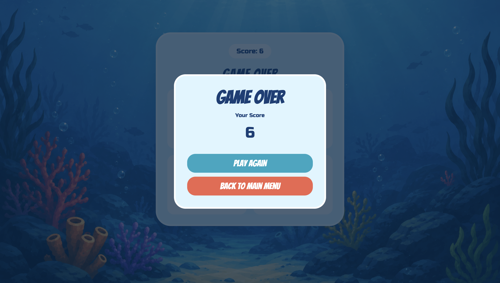

 

  
  
  

 

 
 

># Game Link 
- https://ruqayaahabib.github.io/Sea-Memory/

 
 
 

#  Description
Sea Memory is a memory game where the player watches a sequence of sea animals, The game contains four sea animals:

 Turtle - Fish - Octopus - Jellyfish  

  
and tries to repeat the same sequence in the correct order.
The sequence becomes longer after every successful round, making the game more challenging as the player continues.

 
 
 

#  User Stories

- As a user, I should see a main menu when I first open the game.
- As a user, I should be able to start the game by clicking the Start Game button.
- As a user, I should see and remember the computer's sequence of sea animals.
- As a user, I should know when it is my turn to repeat the sequence.
- As a user, I should be able to click the sea animals to repeat the sequence.
- As a user, my score should increase when I complete the sequence correctly.
- As a user, I should always be able to see my current score.
- As a user, I should see a Game Over popup and my final score when I make a wrong choice.
- As a user, I should be able to restart the game or return to the main menu.

 
 
 

# Screenshots

##  Main Menu

The main menu displayed when the player first opens Sea Memory.

 

##  Game Screens

The main game screen where the player watches and repeats the sea animal sequence.

 

 

## Game Over Screen

The popup displayed when the player selects the wrong animal.

 
 
 

# Future Enhancements

- **Difficulty Levels**: Add Easy, Medium, and Hard game modes.

- **Sound Effects**: Play sounds when animals are shown or clicked.

- **Background Music**: Add underwater background music.

 
 
 

# Credits

### JavaScript
- [Set Time Out](https://developer.mozilla.org/en-US/docs/Web/API/Window/setTimeout)

- [Time Out With loop](https://stackoverflow.com/questions/24293376/javascript-for-loop-with-timeout)

### CSS:
- [CSS Grid Layout](https://www.w3schools.com/css/css_grid.asp)

- [Scale](https://developer.mozilla.org/en-US/docs/Web/CSS/Reference/Values/transform-function/scale)

 
 

